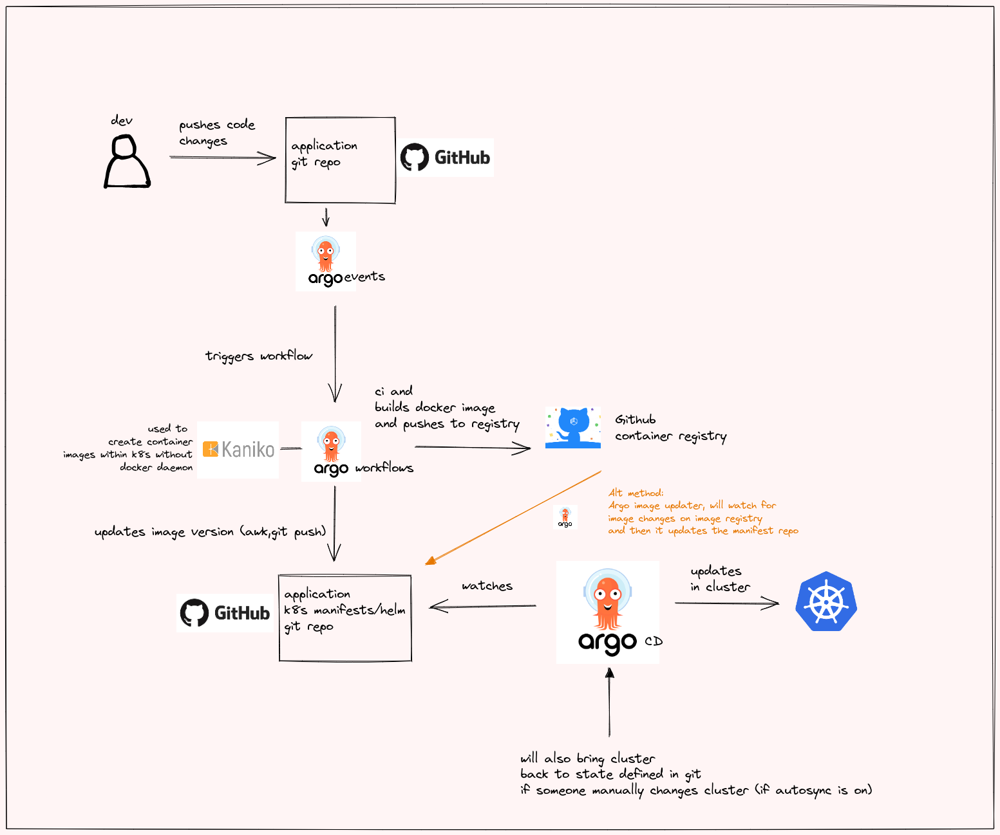

# apolo11-go-api-k8s

This will be the plan for this projec:




# Setup steps:

- Install K8s

```
# Install k0s on the system
curl -sSLf https://get.k0s.sh | sudo sh
sudo k0s install controller --single
sudo k0s start
sudo k0s status

# Check status of nodes

sudo k0s kubectl get nodes
## wait till the nodes are in ready state	
## Here we used the kubectl which comes bundled with k0s, but its better to use the official kubectl client 
```

- Copy the kubeconfig to local user

```
cd ~
## copy the config from k0s admin conf and add in your users .kube folder. 
## note: the user name and group name can be same based on your machine
mkdir .kube
sudo cp /var/lib/k0s/pki/admin.conf .kube/config && sudo chmod 600 .kube/config && sudo chown <user_name>:<group_name> .kube/config

```
- Install native kubectl 

```
# More instuctions here: https://kubernetes.io/docs/tasks/tools/install-kubectl-linux/

curl -LO "https://dl.k8s.io/release/$(curl -L -s https://dl.k8s.io/release/stable.txt)/bin/linux/amd64/kubectl"
curl -LO "https://dl.k8s.io/$(curl -L -s https://dl.k8s.io/release/stable.txt)/bin/linux/amd64/kubectl.sha256"
echo "$(cat kubectl.sha256)  kubectl" | sha256sum --check ## Verify that the output is `kubectl: OK`
sudo install -o root -g root -m 0755 kubectl /usr/local/bin/kubectl

# Check if you can access the cluster using native kubectl
kubectl get nodes
# you should be able to see t

```

- Test by creating a pod:

```
kubectl run nginx --image=nginx
kubeclt get pods
kubectl port-forward nginx 1200:80  # because in some servers ports below 1024 may be blocked due to privilege port restrictions (below 1024)
## in a new terminal
curl localhost:1200 
## you should be able to see the  nginx page html in the output
## once confirmed, clean up the above resources
## Crtl+c the port forward and then delete the pod
kubectl delete pod nginx
```

- Install Traefik

```
## Install helm
curl -fsSL -o get_helm.sh https://raw.githubusercontent.com/helm/helm/main/scripts/get-helm-3
chmod 700 get_helm.sh
./get_helm.sh
helm version # confirms that helm is installed

## Now lets install traefik
## This will isntall a replicaset(and hence a pod) for the traefik ingress controller in default namespace

helm repo add traefik https://helm.traefik.io/traefik
helm repo update
helm install traefik traefik/traefik

## Confirm that the required components are created
helm status traefik
kubectl get all -A # confirm the required traefik resources are created

## port forward to visit the traefik dashboard

## if running from localhost
kubectl port-forward $(kubectl get pods --selector "app.kubernetes.io/name=traefik" --output=name) 9000:9000
OR
## if running on a server, make sure that the server firewall allows connection from your machine
kubectl port-forward $(kubectl get pods --selector "app.kubernetes.io/name=traefik" --output=name) --address 0.0.0.0 9000:9000

## Access the traefik dashboard

## NOTE: Ensure that there is a `/` at the end of the url mentioned below, else the dashboard wont load


## if running from localhost
Go to your browser : http://localhost:9000/dashboard/

OR
## if running on a server, make sure that the server firewall allows connection from your machine

Go to your browser : http://<server_ip>:9000/dashboard/

```

- Create a test ingress route in Traefik

```
kubectl apply -f manifests/traefik/ingressroutes/nginx.yaml
# this will create a test nginx pod and expose it as a clusterip service
# Then it will create a traefik ingressroute to this nginx service

# in a new terminal or tmux, open a port-forward towards the traefik web endpoint 8000
## if running from localhost
kubectl port-forward $(kubectl get pods --selector "app.kubernetes.io/name=traefik" --output=name) 8000:8000
OR
## if running on a server, make sure that the server firewall allows connection from your machine
kubectl port-forward $(kubectl get pods --selector "app.kubernetes.io/name=traefik" --output=name) --address 0.0.0.0 8000:8000


## if running from localhost
Go to your browser : http://localhost:8000/nginx

OR
## if running on a server, make sure that the server firewall allows connection from your machine

Go to your browser : http://<server_ip>:8000/nginx

## Once confirmed, you can delete these routes
kubectl delete -f manifests/traefik/ingressroutes/nginx.yaml

```

- Install argo workflows

```
kubectl create namespace argo
kubectl apply -n argo -f manifests/argo/workflows/install.yaml

## check whether the required resources are created

kubectl get all -n argo 

## ideally you should see that two deployments argo-server and workflow controller are created and there is a argo-server is created


```

- Expose argo-workflows dashboard using traefik

```
kubectl apply -f manifests/traefik/argo-worflow.yaml

## Now check if you can see the argo workflows dashboard
## if running from localhost
Go to your browser : http://localhost:8000

OR
## if running on a server, make sure that the server firewall allows connection from your machine

Go to your browser : http://<server_ip>:8000


```

- Install the argo workflow tool to manage the workflows:

```
cd ~
mkdir bin
echo "PATH=$PATH:~/bin" >> .bashrc && source .bashrc # to add this path to $PATH

# Download the binary
curl -sLO https://github.com/argoproj/argo-workflows/releases/download/v3.4.1/argo-linux-amd64.gz

# Unzip
gunzip argo-linux-amd64.gz

# Make binary executable
chmod +x argo-linux-amd64

# Move binary to path
mv ./argo-linux-amd64 ~/bin/argo

# Test installation
argo version
```

- Run a test workflow:

```

argo submit -n argo --watch https://raw.githubusercontent.com/argoproj/argo-workflows/master/examples/hello-world.yaml


## Now check if you can see the workflow created in workflow dashboard
## if running from localhost
Go to your browser : http://localhost:8000/workflows/argo

OR
## if running on a server, make sure that the server firewall allows connection from your machine

Go to your browser : http://<server_ip>:8000/workflows/argo

```

- Install Argo events

```
kubectl create namespace argo-events

kubectl apply -f https://raw.githubusercontent.com/argoproj/argo-events/stable/manifests/install.yaml
# Install with a validating admission controller
kubectl apply -f https://raw.githubusercontent.com/argoproj/argo-events/stable/manifests/install-validating-webhook.yaml

## install the event bus
kubectl apply -n argo-events -f https://raw.githubusercontent.com/argoproj/argo-events/stable/examples/eventbus/native.yaml

```

- Create a test Argo event webhook

```
kubectl apply -n argo-events -f https://raw.githubusercontent.com/argoproj/argo-events/stable/examples/event-sources/webhook.yaml
## check that the clusterip service is created on port 12000
kubectl get all -n argo-events
```

- Create webhook sensor

```
 # sensor rbac
kubectl apply -n argo-events -f https://raw.githubusercontent.com/argoproj/argo-events/master/examples/rbac/sensor-rbac.yaml
 # workflow rbac
kubectl apply -n argo-events -f https://raw.githubusercontent.com/argoproj/argo-events/master/examples/rbac/workflow-rbac.yaml

kubectl apply -n argo-events -f https://raw.githubusercontent.com/argoproj/argo-events/stable/examples/sensors/webhook.yaml

```

- Test the webhook

```
# expose the webhook endpoint
kubectl -n argo-events port-forward $(kubectl -n argo-events get pod -l eventsource-name=webhook -o name) 12000:12000 &

# send a curl req to trigger the webhook
curl -d '{"message":"this is my first webhook"}' -H "Content-Type: application/json" -X POST http://localhost:12000/example

# list the workflow
argo list -n argo-events
# check the logs of the triggered workflow
argo logs -n argo-events @latest
```

- Creating github webhook(event source) to trigger pipeline


```
## you will need a reverse proxy (nginx) to point to your service
sudo apt install nginx -y 

## confirm that nginx is running properly

sudo systemctl status nginx
sudo ss - tlp | grep nginx # to confirm if its listening on port 80

## Create a new server route 

sudo cat << EOF >> /etc/nginx/sites-available/default
server {
  listen 80;
  server_name argo.iamcloudnative.com # replace this with whatever domain you have kept
  location / {

    proxy_pass http://localhost:30007
    proxy_buffering off;
    proxy_set_header X-Real-IP $remote_addr;
    proxy_set_header X-Forwarded-Host $host;
    proxy_set_header X-Forwarded-Port $server_port;

  }
}
EOF

## This will append the reverse proxy route for the nodeport expose we will create below
sudo systemctl restart nginx
```

Now we will create the webhook 

```
# Create a github access token with webhook creation permissions
# Follow: https://help.github.com/en/github/authenticating-to-github/creating-a-personal-access-token-for-the-command-line

# Then create a base64 value for it
echo -n <github-api-token-key> | base64

# update this base64 value in ./manigests/secrets/github-secret.yaml
# create the secret in the argo-events namespace

kubectl apply -f manigests/secrets/github-secret.yaml

## confirm that the secret has been created

kubectl get secrets 0n argo-events 

# Next create the event source
# update the owner and repository and server url details in manifests/argo/events/eventsources/github.yaml to match your requirements

kubectl apply -n argo-events -f manifests/argo/events/eventsources/github.yaml

 you should be able to see the webhook created at https://github.com/<user-name>/<repo-name>/settings/hooks
```
